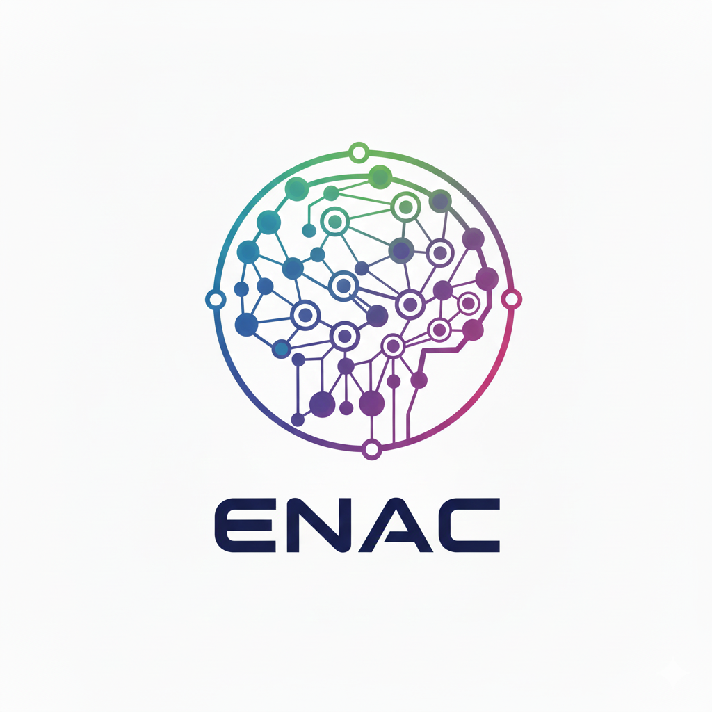

# ✈️ Projet de Réseau de Neurones ENAC

## Logo du Projet

## Description

Ceci est un projet étudiant de l'ENAC (École Nationale de l'Aviation Civile) axé sur les réseaux de neurones référent Teo Chauvin
